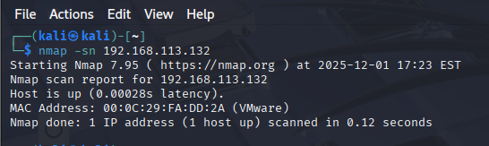
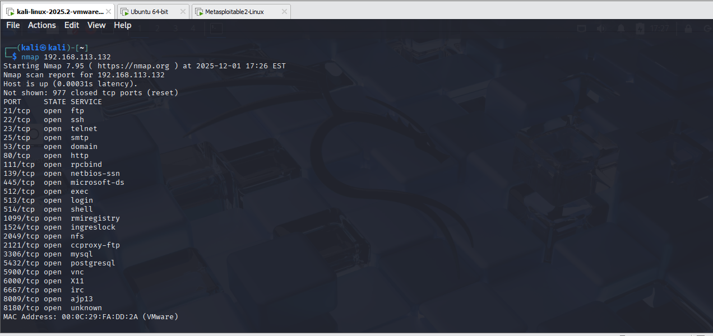

# Nmap Basics – First Practical Scanning Session  
**Date:** 2025-12-01  
**Lab Environment:** Kali Linux attacking machine → Metasploitable2 target

---

## Introduction
Today I began my practical cybersecurity journey by running my very first Nmap scans against a controlled vulnerable machine (Metasploitable2).  
My goal was not to rush through tools, but to slow down and understand *why* each command is used and what the results mean in a real-world security context.  

This session marks the start of building consistent hands-on skills alongside my academic studies. I plan to document every session so I can track my growth and build a strong cybersecurity portfolio.

---

## Lab Setup Summary
- **Attacker Machine:** Kali Linux  
- **Target Machine:** Metasploitable2  
- **Network:** Host‑only / NAT (both machines reachable in same network)  
- **Target IP Discovered:** `192.168.113.132`

*(Screenshots can be inserted using syntax:  
``)*

---

## Objective of the Session
1. Practice basic Nmap scanning techniques  
2. Understand how host discovery, open ports, and OS detection work  
3. Learn why these steps matter in real penetration testing  
4. Build confidence with interpreting scan results

---

## Commands Used Today

### 1. Host Discovery (Ping Scan)
```bash
nmap -sn 192.168.113.132
```

### 2️. Default Port Scan
```bash
nmap 192.168.113.132
```


### 3️. Full Detailed Scan
```bash
nmap -sV -sC -O 192.168.113.132
```


## Flags used:

-sV → Service and version detection

-sC → Default safe scripts

-O → Operating system detection

## Purpose:
Get deeper insights

---

## What I have Learned Today
 # Nmap is a full discovery framework used for: 
 -identifying live hosts
 -finding network services
 -detecting versions and OS
 -mapping attack surfaces

---

## Reflections

This was a light practice day, but an important one.
I am focusing on:
-understanding tools slowly
-building consistent habits
-learning the reasoning behind each command
-I will continue practicing with CTF tasks from university and platforms like TryHackMe as they align well with today’s foundational work.

